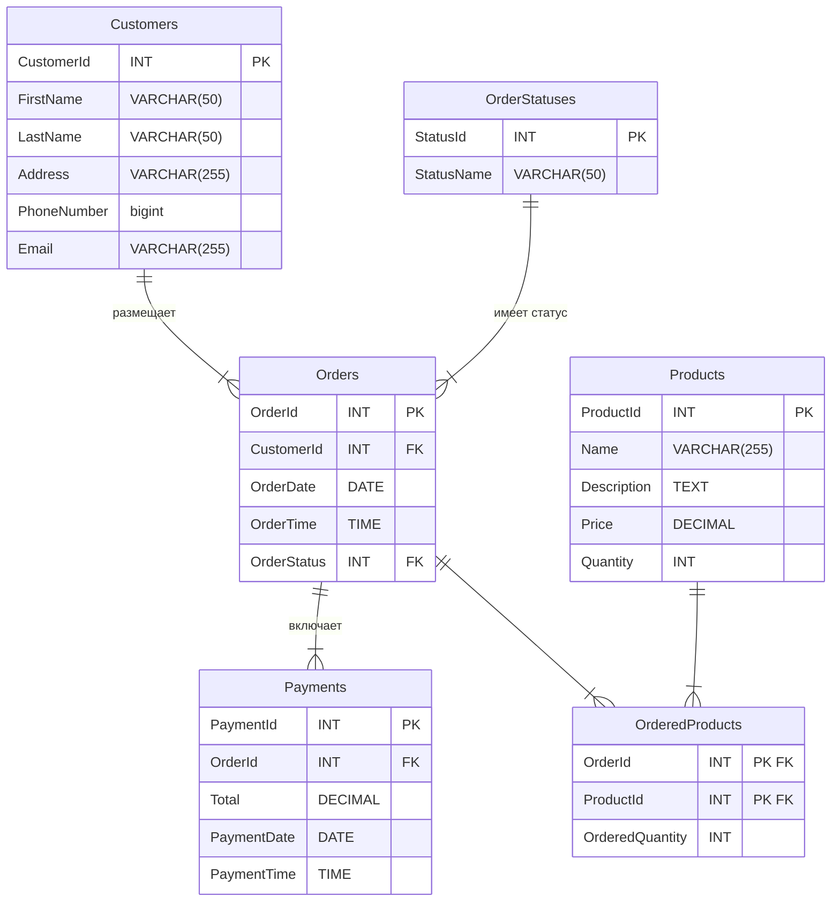

# База данных

Соответсвие названий таблиц русским словам

| Название таблицы | Название на русском |
|------------------|---------------------|
| Customers        | Заказчики           |
| Orders           | Заказы              |
| OrderStatuses    | Статусы заказа      |
| Payments         | Платежи             |
| OrderedProducts  | Заказанные товары   |
| Products         | Товары              |

