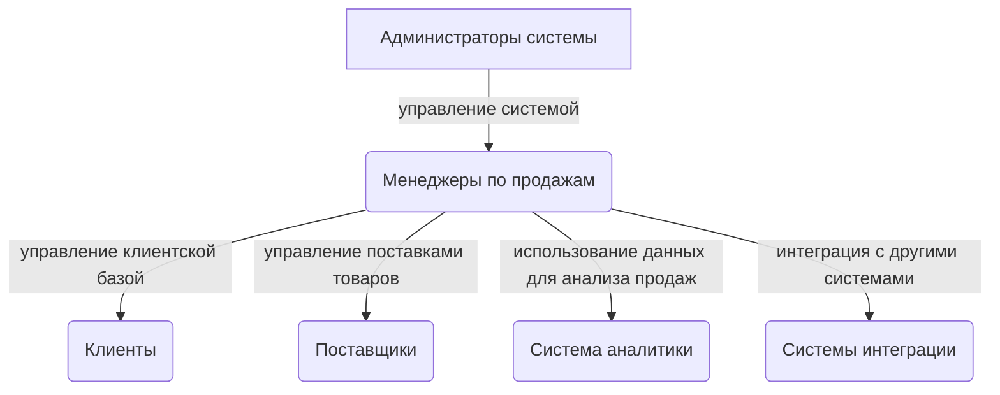

## Введение

> #### Цель проекта
> Автоматизировать управление продажами.

> #### Целевая аудитория
> Предприятия занимающиеся продажей товаров.

> #### Краткое описание
> Система управления продажами (CRM) представляет собой программное обеспечение, которое позволяет компаниям
> автоматизировать и улучшить процессы управления клиентами, заказами и продажами.

## Общее описание

### Модели объектов

Товар:

- Наименование
- Описание
- Цена
- Количество
- Фотографии
- Категория
- Поставщик

Клиент:

- Имя
- Контактная информация
- История заказов
- Предпочтения
- Скидки

Заказ:

- Дата
- Статус
- Список товаров
- Клиент
- Способ доставки
- Адрес доставки

Платеж:

- Дата
- Сумма
- Способ оплаты
- Заказ

Отчет о продажах:

- Общая выручка
- Количество проданных товаров
- Наиболее популярные товары
- Динамика продаж

Инвентарь:

- Уведомления о нехватке товаров
- Автоматическое пополнение запасов
- Учет поставщиков

Скидки и акции:

- Настройка скидок на определенные товары
- Временные промо-коды
- Акционные предложения

Доставка:

- Способы доставки
- Стоимость доставки
- Отслеживание статуса доставки
- Возврат товаров

Налоги:

- Автоматический расчет налогов
- Отчетность
- Налоговые льготы

Пользователи:

- Роли и права доступа
- Авторизация
- Аутентификация

### Участники

- Администратор
- Менеджер по продажам
- Клиенты
- Поставщики
- Система аналитики
- Система интеграции

### Use-case

Управление товарами:

- Администратор системы может добавлять, изменять и удалять товары.
- Менеджеры по продажам могут просматривать и редактировать информацию о товарах.
- Система должна предоставлять возможность добавления фотографий, описания, цены и количества товаров.

Управление клиентами:

- Менеджеры по продажам могут добавлять, изменять и удалять информацию о клиентах.
- Клиенты могут просматривать и изменять свои персональные данные.
- Система должна предоставлять возможность просмотра истории заказов для каждого клиента.

Управление заказами:

- Менеджеры по продажам могут создавать, изменять и отменять заказы.
- Клиенты могут просматривать и изменять статус своих заказов.
- Система должна предоставлять возможность отслеживания статуса доставки для каждого заказа.

Управление платежами:

- Менеджеры по продажам могут просматривать информацию о платежах и подтверждать оплату заказов.
- Клиенты могут производить оплату заказов различными способами (например, кредитной картой, электронным переводом и т.
  д.).
- Система должна предоставлять возможность формирования отчетов о платежах.

Аналитика продаж:

- Менеджеры по продажам и администраторы системы могут просматривать отчеты о продажах, анализировать данные и выявлять
  тенденции.
- Система должна предоставлять возможность формирования различных отчетов (например, общая выручка, количество проданных
  товаров, наиболее популярные товары и т. д.).

## Требования

1. Система должна иметь возможность учета товаров, включая название, описание, цену, количество и фотографии.
2. Система должна иметь возможность учета клиентов, включая имя, контактную информацию и историю заказов.
3. Система должна иметь возможность учета заказов, включая дату, статус, товары и клиентов.
4. Система должна иметь возможность учета платежей, включая дату, сумму и способ оплаты.
5. Система должна иметь возможность генерировать отчеты о продажах, включая общую выручку, количество проданных товаров
   и наиболее популярные товары.
6. Система должна иметь возможность управления инвентарем, включая уведомления о нехватке товаров и автоматическое
   пополнение запасов.
7. Система должна иметь возможность управления скидками и акциями, включая настройку скидок на определенные товары и
   временные промо-коды.
8. Система должна иметь возможность управления доставкой, включая выбор способа доставки и отслеживание статуса
   доставки.
9. Система должна иметь возможность управления возвратами, включая обработку возвратов и возврат денежных средств.
10. Система должна иметь возможность управления налогами, включая автоматический расчет налогов и отчетность.
11. Система должна иметь возможность управления пользователями, включая роли и права доступа.
12. Система должна иметь возможность интеграции с платежными системами, такими как PayPal и Stripe.
13. Система должна иметь возможность интеграции с системами доставки, такими как DHL и FedEx.
14. Система должна иметь возможность интеграции с системами учета, такими как QuickBooks и Xero.
15. Система должна иметь возможность интеграции с системами аналитики, такими как Google Analytics и Mixpanel.
16. Система должна иметь возможность работать на разных устройствах и платформах, включая компьютеры, планшеты и
    мобильные устройства.
17. Система должна иметь возможность обеспечивать безопасность данных, включая шифрование и защиту от
    несанкционированного доступа.
18. Система должна иметь возможность обеспечивать высокую производительность, включая быстрый доступ к данным и
    минимальное время ответа.
19. Система должна иметь возможность обеспечивать легкость использования, включая интуитивно понятный интерфейс и
    простую навигацию.
20. Система должна иметь возможность обеспечивать гибкость настройки, включая настройку параметров и настройку внешнего
    вида.