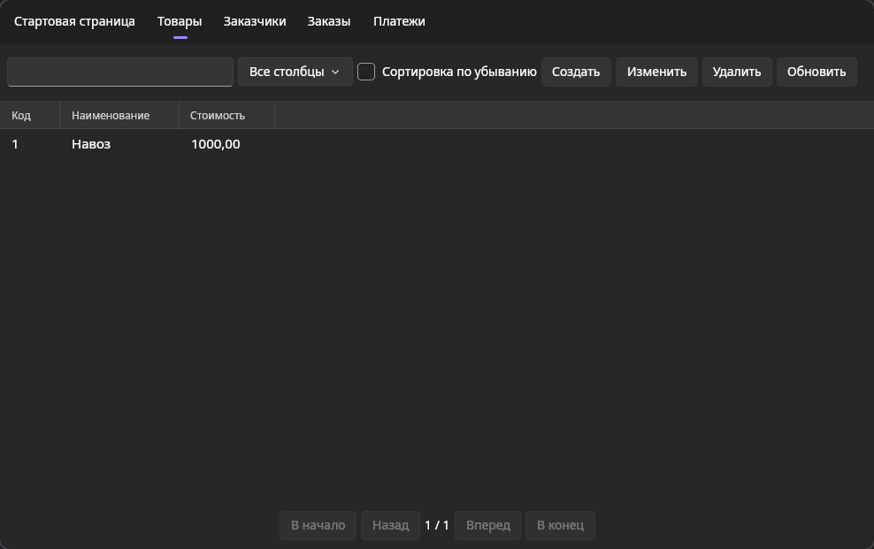

# Руководство системного программиста

### Общие сведения о программе

Программа предназначена для управления продажами. Цель программы -
автоматизировать и улучшить процессы управления клиентами, заказами и продажами компании.

### Структура программы

Программа состоит из главного окна, в котором отображаются различные вкладки с таблицами

Такие как:
- Стартовая страница
- Товары
- Заказчики
- Заказы
- Платежы

### Настройка программы

### Проверка программы

### Дополнительные возможности

### Сообщение системному программисту
